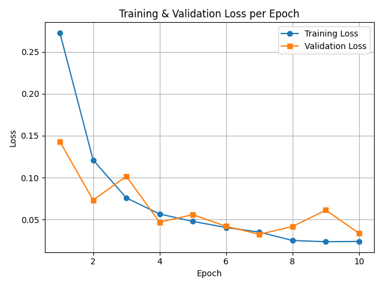

# 🤖 Project: Automated Classification of FTU Regions in Equine Scintigraphic DICOM Images Using CNNs

This project focuses on building a deep learning-based classification pipeline for scintigraphic DICOM images of horse joints. It consists of two main modules:

1. **Binary Classification**: Distinguishing FTU(Orgin of the suspensory ligament) vs Non-FTU regions.
2. **Multi-Class Classification**: Labeling FTU regions into 10 anatomical classes.

---

## 📌 Step 1: FTU vs Non-FTU Classification

This module implements a CNN-based binary classification system to detect **FTU (orgin of the suspensory ligament)** versus **Non-FTU** regions in scintigraphic images.

---

## 📁 Directory Structure

FTU vs Non FTU Classification
- `Dataset.py` – DICOM dataset loader with preprocessing and augmentation
- `Model.py` – FTUCNN architecture definition
- `Train.py` – Script for training the model
- `Test.py` – Script for running inference on test data
- `Evaluation.py` – Generates classification report and confusion matrix
- `model_FTU_nonftu.pth` – Saved trained model

---

## 🧠 Model Details

| Component       | Description                                         |
|----------------|-----------------------------------------------------|
| Architecture    | Custom CNN (`FTUCNN`) with BatchNorm               |
| Input Shape     | 128 × 128                                           |
| Optimizer       | AdamW                                              |
| Learning Rate   | 0.0001                                             |
| Epochs          | 10                                                 |
| Loss Function   | CrossEntropyLoss with class weights                |
| Regularization  | BatchNorm + Weight Decay (0.0001)                  |
| Augmentations   | FTU: Contrast jitter + rotation Non-FTU: None   |

---

## 🧪 Results (Updated)

### ✅ Classification Report
- **Validation Accuracy:** `98.54%`
- **FTU Recall (Sensitivity):** `96.32%`
- **Non-FTU Specificity:** `98.92%`
- **FTU Precision:** `94%`
- **Non-FTU Precision:** `99%`

| Class     | Precision | Recall | F1-score | Support |
|-----------|-----------|--------|----------|---------|
| Non-FTU   | 0.99      | 0.99   | 0.99     | 1115    |
| FTU       | 0.94      | 0.96   | 0.95     | 190     |
| **Accuracy** |         |        | **0.99** | **1305** |

#### 📉 Confusion Matrix

.png)

#### 📋 Classification Report Screenshot

#### 📈 Training vs Validation Loss Plot

## 📌 Step 2: 10-Class FTU Region Classification

This module classifies FTU regions into 10 anatomical labels using a fine-tuned ResNet18 architecture.

---

## 📁 Directory Structure

10-Class FTU Classification:
- `Dataset.py` – DICOM multi-class dataset loader
- `Model.py` – ResNet18 model adapted for grayscale
- `Train.py` – Model training pipeline
- `Test.py` – Model evaluation script
- `Evaluate.py` – Classification report with sensitivity & specificity
- `model_res18.pth` – Trained multi-class model

---

## 🧠 Model Details (ResNet18)

| Component       | Description                                       |
|----------------|---------------------------------------------------|
| Architecture    | ResNet18 pretrained on ImageNet                  |
| Input Layer     | Modified for 1-channel grayscale input           |
| Layers Trained  | `layer4` and `fc`; earlier layers frozen         |
| Dropout         | 0.3 at FC                                        |
| Optimizer       | AdamW                                            |
| Learning Rate   | 0.0001                                           |
| Epochs          | 20                                               |
| Loss Function   | CrossEntropyLoss             |
| Augmentations   | Rotation + Contrast Jitter                       |
| Training Time   | ⏱️ 3 min 24 sec                                   |

---

## 🧪 Results (10-Class FTU Classification)

### ✅ Final Metrics
- **Train Accuracy:** 99.59%
- **Validation Accuracy:** 96.20%
- **Test Accuracy:** 98.37%
- **Test Loss:** 0.0858

#### 📉 Confusion Matrix

#### 📋 Classification Report Screenshot

#### 📈 Training vs Validation Loss Plot

---

## ✅ Conclusion

- Binary CNN classifier performs robustly for FTU vs Non-FTU detection.
- ResNet18 (partially fine-tuned) achieves top performance on the 10-class FTU region task.
- Training is efficient and performance generalizes well to test data.

---